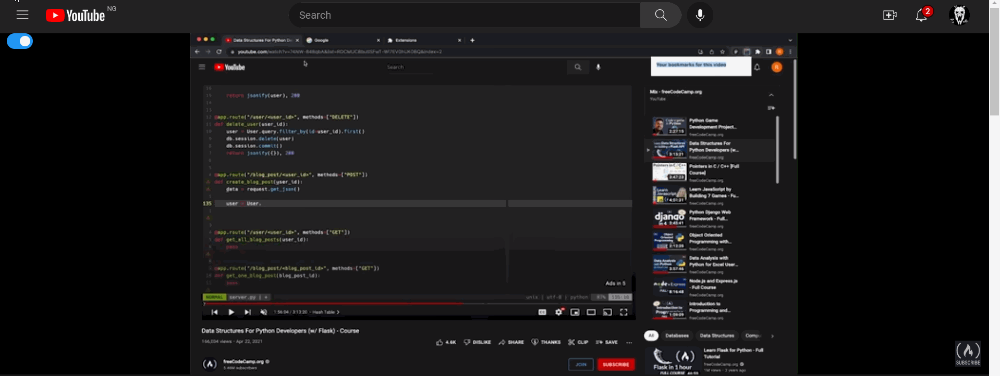

🔴 Hide YouTube Player: The Ultimate YouTube Bottom Video Player Hider! 🔵
======================================================

Tired of constantly struggling to read text at the buttom of tutorial videos? Say goodbye to that pesky player and hello to seamless video control with Hide YouTube Player! With just one click, this Chrome extension lets you hide or show the YouTube bottom player on demand. It's like a magic button for your videos! 🎉

Installation 💾
---------------

Installing Hide YouTube Player is a breeze:

1.  Download the zipped folder from the my github releases page. 📥
2.  Unzip it
3.  Open the Chrome extensions page (chrome://extensions/) in your browser or click the extension icon 🌐
4.  Make sure the developer mode in toggled on and click load unpacked.
5.  Load the folder. 🖱️
6.  *Poof*! The extension is now installed and ready to use. 🎊

Usage 🎮
--------

Using Hide YouTube Player is super simple:

1.  Click the toggle button in the Chrome toolbar to hide or show the YouTube player. 🔕🔔
2.  The button will turn grey when the player is off and blue when the player is on. ⚪🔵
3.  Sit back and enjoy your newfound video control powers! 😎

Notes 📝
--------

-   The extension only works on the YouTube website.
-   The extension will not work if the YouTube player is embedded in another website.
-   The extension may not work with certain types of videos (e.g. live streams). But hey, we can't win 'em all! 🤷‍♂️

So why wait? Install Hide YouTube Player now and take control of your video viewing experience! 🚀
---

---
## Thanks
- ChatGPT
- freecodecamp (Build a Chrome Extension)